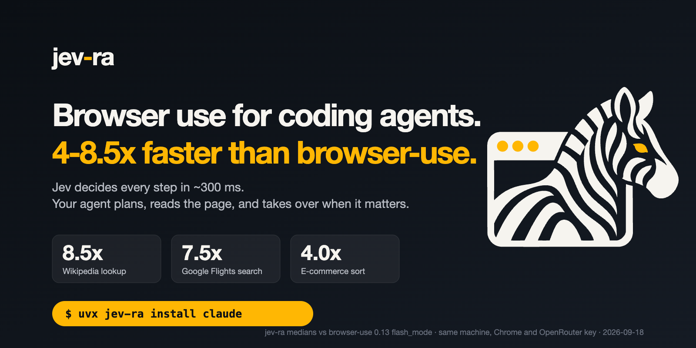
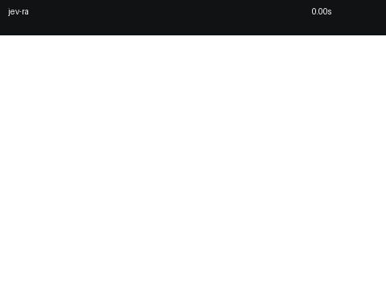
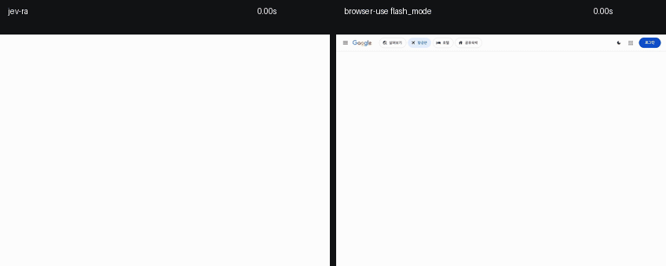

<p align="center">
  
</p>

<p align="center">
  <a href="https://github.com/brnyxx/jev-ra/actions/workflows/ci.yml"></a>
  <a href="https://pypi.org/project/jev-ra/"></a>
  
  
  
  <a href="LICENSE"></a>
</p>

[](../BENCHMARKS.md)

[English](../../README.md) · **한국어** · [日本語](README.ja.md) · [简体中文](README.zh-CN.md)

# jev-ra

**CLI 코딩 에이전트를 위한 빠른 브라우저 조작 계층.** Claude Code, Codex, 또는 MCP 클라이언트가
jev-ra에 목표를 넘긴다. System One 결정 모델인 TypeSafe Jev가 한 번의 왕복으로 각 단계의 연산과
대상 요소를 함께 고른다. 계획을 세우고, 입력할 값을 주고, 페이지를 읽고, jev-ra가 escalate하면
넘겨받는 것은 호출한 에이전트의 몫이다. 루프 안에서 두 번째 LLM이 도는 일은 없다.



| 과제 | browser-use 0.13.10 + gemini-3-flash `flash_mode` | jev-ra | |
|---|---|---|---|
| Wikipedia: 괴델 불완전성 정리 문서 열기 | 23,058 ms | **2,714 ms** | **8.50×** |
| Google Flights ZRH→LON 편도, 결과 표시까지 | 66,414 ms | **8,888 ms** | **7.47×** |
| 올리브영 카테고리: 신상품순 정렬 | 15,071 ms | **3,806 ms** | **3.96×** |

각 5회 실행의 중앙값. 2026-09-18, 같은 머신, 같은 전용 Chrome, 양쪽 모두 OpenRouter 경유.
각 실행은 마지막 페이지를 기준으로 검증했고, 25번 중 25번 통과했으며 텍스트 모델 호출은 0이었다.
[측정 방법, p90, 비용, 원본 기록](../BENCHMARKS.md).

## 빠른 시작

**Claude Code**

```sh
export OPENROUTER_API_KEY=sk-or-...
uvx jev-ra install claude
# 이후 Claude Code에서: "wikipedia.org 열어서 괴델 불완전성 정리 문서 찾아줘"
```

**Codex**

```sh
export OPENROUTER_API_KEY=sk-or-...
uvx jev-ra install codex
# 이후 Codex에서: "jev-ra로 wikipedia.org 열어서 괴델 불완전성 정리 문서 찾아줘"
```

**셸**

```sh
export OPENROUTER_API_KEY=sk-or-...
uvx jev-ra doctor
uvx jev-ra run https://en.wikipedia.org/wiki/Main_Page "Open the Godel incompleteness article." \
  --value "search_query=Godel incompleteness theorems"
```

Python을 따로 갖추기 싫다면 `npx -y jev-ra install claude`가 npm 런처로 같은 일을 한다. npm 패키지는
런처일 뿐이다. `uv`를 찾고, 없으면 설치를 제안하고, 자기 버전에 고정된 PyPI 패키지를 실행한다.

어느 쪽이든 설치 단계는 없다. `uvx`가 PyPI에서 바로 실행하고, 서버 명령으로 `uvx jev-ra mcp`를
등록한다. 영구 설치는 `uv tool install jev-ra`. 키는 이미 export해 둔 변수에서 전달되며 출력되지
않는다.

## 동작 방식

```
  당신의 에이전트                  jev-ra                              Chrome
 ────────────────            ───────────────                      ─────────────
  목표 + values  ──────────▶  observe ─────────────────────────▶  snapshot.js
                              │   요소, 가드, 페이지 marker      ◀──── eval 한 번
                              ▼
                              한 번의 요청: 연산? 대상?
                              값? prev_ok? goal_achieved?    ──▶  Jev  (~300 ms)
                              │
                              ▼
                              신선도 가드 ──▶ act ─────────────▶  신뢰된 CDP 입력
                              │                                    (JS 클릭 아님)
                              ▼
                              url/title/text/필드 상태 검증
                              │
       Result  ◀──────────────┴── done · blocked · escalate · budget
```

단계마다 결정 하나. 페이지에 입력되는 텍스트는 당신이 준
값뿐이다.

## MCP 도구

| 도구 | 인자 | 하는 일 |
|---|---|---|
| `browser_open` | url | 공유 세션에서 URL을 열고 페이지를 요약한다. |
| `browser_run` | goal, values?, max_steps? | 목표 전체를 수행한다. 입력이 필요한 값은 values로 준다. |
| `browser_search` | query, goal?, max_pages? | 검색하고, 상위 결과를 병렬 탭에서 읽어 목표 기준으로 순위를 매긴다. |
| `browser_act` | instruction, values? | 지시에 맞는 한 단계를 결정해 실행한다. |
| `browser_observe` | max_elements? | 관측된 컨트롤과 보이는 텍스트를 나열한다. |
| `browser_extract` | mode? | 구조화된 페이지 데이터: `text`, `elements`, `links`, `tables`, `main`. |
| `browser_click` | ref | 관측된 요소를 ref로 클릭한다. |
| `browser_type` | ref, text | 관측된 입력 필드에 텍스트를 넣는다. |
| `browser_select` | ref, option | 관측된 드롭다운 옵션을 고른다. |
| `browser_scroll` | direction? | 한 화면만큼 위아래로 스크롤한다. |
| `browser_press` | key | Enter, Escape, Tab을 누른다. |
| `browser_wait` | - | 잠시 기다린 뒤 다시 관측한다. |
| `browser_screenshot` | - | 현재 뷰포트의 JPEG. |
| `browser_close` | - | 서버가 들고 있는 세션을 닫는다. |

모든 응답에 `elapsed_ms`가 담기고, Jev를 호출했다면 `decisions`와 `cost`도 함께 담긴다.

## CLI

| 명령 | 하는 일 |
|---|---|
| `run URL "goal" [--value name=text ...] [--max-steps N]` | URL에서 목표를 추구하고 완료되거나 에스컬레이션되면 멈춘다 |
| `search "query" ["what the page must answer"] [--max-pages 3]` | 웹을 검색하고 가장 좋은 결과를 읽는다 |
| `open URL` | URL을 열고 이후 명령을 위해 세션을 유지한다 |
| `observe` | 열린 페이지의 컨트롤과 텍스트를 나열한다 |
| `extract [--mode text\|elements\|links\|tables\|main]` | 열린 페이지에서 구조화된 데이터를 뽑는다 |
| `act "instruction" [--value name=text ...]` | 열린 페이지에서 결정된 한 단계를 실행한다 |
| `click REF` | 관측된 요소 하나를 클릭한다 |
| `type REF TEXT` | 관측된 필드 하나에 입력한다 |
| `select REF OPTION` | 관측된 드롭다운 옵션을 고른다 |
| `scroll down\|up` | 열린 페이지를 스크롤한다 |
| `press Enter\|Escape\|Tab` | Enter, Escape, Tab을 누른다 |
| `wait` | 잠시 기다린 뒤 다시 관측한다 |
| `screenshot [PATH]` | 뷰포트를 JPEG로 저장한다 |
| `close` | `open`이 남긴 세션을 닫는다 |
| `mcp` | MCP stdio 서버를 실행한다 |
| `skill` | 에이전트 가이드를 출력한다. 스킬 파일로 저장할 수 있다 |
| `install claude\|codex [--scope user\|project\|local]` | jev-ra를 코딩 에이전트의 MCP 서버로 등록한다 |
| `doctor` | 키, 엔드포인트, Chrome, 라이브 결정 하나를 점검한다 |
| `bench [--live]` | 오프라인 픽스처를 재고, `--live`면 라이브 과제도 잰다 |
| `corpus run` | 실제 사이트 코퍼스를 실행한다 |

`open` … `close`는 `$XDG_STATE_HOME/jev-ra/session.json`의 target id를 통해 하나의 브라우저를
여러 호출에 걸쳐 공유한다. 어느 명령에든 `--json`을 붙이면 원본 페이로드가 나온다.

## Python

```python
from jev_ra import Agent

with Agent() as agent:
    result = agent.run(
        "Place the order with express shipping.",
        values={"name": "Ada Lovelace", "email": "ada@example.com"},
        url="https://example.com/checkout",
    )
print(result.status, result.elapsed_ms, [step["target_label"] for step in result.steps])
```

## 값

TYPE_TEXT에는 문자열이 필요하고, jev-ra는 그것을 지어내지 않는다. 필드를 고르는 같은 왕복 안에서
Jev가 *당신이 준* 값 중 어느 것이 그 필드에 들어갈지 고른다. 맞는 값이 없고 텍스트 헬퍼도 설정돼
있지 않으면 실행은 `needs_value`로 멈추고 필드의 label, role, 현재 값을 알려준다. 값을 주고 다시
호출하면 된다. 기본 설치에는 텍스트 모델이 없다.

## 제어를 되돌려줄 때

`Result.status`는 `done`, `blocked`, `escalate`, `budget` 중 하나다. 실행이 중간에 멈추면 `reason`은
`needs_value`, `stuck_loop`, `unverified_done`, `stale`, `invalid_decision`, `too_many_controls`,
`blocked`, `budget` 중 하나다. `budget`은 소진된 예산(스텝, 결정, 시간, 또는 공급자가 답하지
않은 결정)을 `detail`에 함께 담는다. escalate에는 확률이
붙은 상위 8개 연산/대상 후보와 최대 3,000자의 페이지 텍스트가 담긴다. 다시 관측하지 않고도 판단할
수 있을 만큼이다.

검증은 결정론적이다. 매 행동 뒤 url, title, text, 필드 상태를 비교하고, `page_changed`는 모델의
의견이 아니라 페이지의 의미 기반 marker에서 나온다.

## 벤치마크

다섯 과제, 각 5회 실행, 모든 실행을 남긴 페이지 기준으로 검증했다:

| 과제 | 중앙값 | p90 | 성공 | 결정 | 비용 | 비율 |
|---|---|---|---|---|---|---|
| Wikipedia 문서 | 2,714 ms | 3,179 ms | 5/5 | 3 | $0.00075 | 8.50× |
| Google Flights 검색 | 8,888 ms | 10,573 ms | 5/5 | 14 | $0.00317 | 7.47× |
| 올리브영 정렬 | 3,806 ms | 4,858 ms | 5/5 | 4 | $0.00204 | 3.96× |
| 인용까지 포함한 검색 | 2,416 ms | 2,571 ms | 5/5 | 4 | $0.00035 | 기준선 없음 |
| 로컬 결제 폼 | 2,191 ms | 2,338 ms | 5/5 | 5 | $0.00049 | 기준선 없음 |

비율은 같은 머신, 같은 Chrome에서 돌린 browser-use 0.13.10 + gemini-3-flash `flash_mode`
기준이다(각각 23,058 ms, 66,414 ms, 15,071 ms). 25회 전체에서 텍스트 모델 호출은 0.
같은 하네스로 browser-use를 과제당 5회 다시 돌린 결과는 더 느렸다: 9.07×, 8.31×, 7.26×.
우리 중앙값을 browser-use의 과제별 최고 기록(15,759 ms, 49,914 ms, 17,647 ms)과 비교하면
5.8×, 5.6×, 4.6×이고, 헤드라인의 3-5×는 그보다 낮은 값이다.
`jev-ra bench --live --runs 5`로 이 표를 재현할 수 있고, 기준선이 있는 모든 과제에 대해 3×
이상이라는 v0.1 기준의 PASS/FAIL을 찍는다.
[측정 방법, browser-use 원본 기록, 재현 방법](../BENCHMARKS.md).

왼쪽이 jev-ra, 오른쪽이 browser-use `flash_mode`. 같은 과제, 같은 Chrome, 실시간:



과제를 해내지 못하고 끝난 실행은 시간이 아니라 실패로 센다.

## 하지 않는 것

| 한계 | 결과 |
|---|---|
| 캔버스 드로잉, 게임 등 마크업이 아니라 그려진 것 | `blocked`: 목표를 진행시킬 수 있는 관측된 컨트롤이 없음 |
| 파일 업로드 | `blocked`: 파일 입력은 제시되지도, 입력되지도 않음 |
| CAPTCHA, 봇 차단, 스텔스 | 페이지 텍스트와 함께 `blocked`, 판단은 호출자 몫 |
| 인증 흐름 | 필드 이름을 담은 `needs_value`. 자격 증명을 추측하지 않음 |
| 팝업 창, 멀티 탭 워크플로 | 실행은 자기 타깃에 머무름 |
| 교차 출처 iframe | 불투명한 요소 하나로 보고. 열린 shadow root와 동일 출처 iframe은 **순회함** |
| 보이는 컨트롤이 250개를 넘을 때 | `omitted`를 보고하고, 막힌 실행은 추측 대신 `too_many_controls`로 에스컬레이션 |

각각 페이지 텍스트와 순위가 매겨진 후보를 담은 에스컬레이션을 돌려준다.
## FAQ

**OpenRouter인가 TypeSafe 키인가?** 둘 다 된다. jev-ra는 `JEV_RA_API_KEY`, `TYPESAFE_API_KEY`,
`OPENROUTER_API_KEY` 순으로 키를 찾는다. `sk-or-`로 시작하는 키는 OpenRouter 경로
(`typesafe/jev-1.13`)를, 그 외에는 직접 경로(`jev-latest`)를 고른다. `JEV_RA_ENDPOINT`와
`JEV_RA_MODEL`이 둘 다 덮어쓴다. OpenRouter가 구하기 쉽고, 상류 측정에 따르면 직접 호출이 결정당
약 140 ms 빠르다.

**한 과제에 얼마가 드나?** **$0.00035**(검색, 결정 4번)에서 **$0.00317**(Google Flights 전체 흐름,
결정 14번) 사이다. 비용은 페이지 크기가 아니라 결정 횟수에 비례한다. 보내는 상태가 HTML이 아니라
요소 표와 보이는 텍스트이기 때문이다.

**전용 Chrome이 필요한가?** 직접 찾거나 자체 프로필(`$XDG_STATE_HOME/jev-ra/chrome-profile`)로
띄워서 재사용한다. `BU_CDP_URL`로 다른 Chrome을 가리킬 수 있다. 에이전트에게 맡기고 싶지 않은
계정에 로그인된 브라우저는 가리키지 마라.

**왜 텍스트 모델이 없나?** 호출하는 에이전트가 이미 문맥을 갖고 있다. 두 번째 모델을 넣으면
필드당 675-938 ms가 더 들고 값을 지어낸다. 원하면 `JEV_RA_TEXT_MODEL`로 붙일 수 있다.

## 설정

| 변수 | 효과 |
|---|---|
| `JEV_RA_API_KEY`, `TYPESAFE_API_KEY`, `OPENROUTER_API_KEY` | 키, 이 우선순위로 |
| `JEV_RA_ENDPOINT`, `JEV_RA_MODEL` | 경로 재정의 |
| `JEV_RA_CHROME` | 띄울 브라우저 바이너리 경로 |
| `BU_CDP_URL` | 새로 띄우는 대신 붙을 기존 Chrome |
| `JEV_RA_VIEWPORT` | 예: `1280x900` (기본값) |
| `JEV_RA_MAX_STEPS`, `JEV_RA_MAX_DECISIONS`, `JEV_RA_TIMEOUT_S` | 예산 (40 / 80 / 120) |
| `JEV_RA_BLOCK_RESOURCES` | `0`이면 폰트/미디어 차단을 끈다 |
| `JEV_RA_SEARCH_URL` | 검색 엔드포인트 템플릿, `{query}`가 치환된다 |
| `JEV_RA_TEXT_MODEL`, `JEV_RA_TEXT_BASE_URL`, `JEV_RA_TEXT_API_KEY` | 선택적 텍스트 헬퍼, 기본은 꺼짐 |

`$XDG_CONFIG_HOME/jev-ra/config.json`에 같은 키를 쓸 수 있고, 환경변수가 우선한다.

## 출처

`jev_ra/browser/snapshot.js`와 `NEXT_ACTION` / `TARGET` 지시문은
[browser-use/jev-ultrafast](https://github.com/browser-use/jev-ultrafast)(MIT)에서 가져와 다듬은
것이며, 그곳에서 측정된 텍스트다. Chrome 구동은
[browser-harness](https://github.com/browser-use/browser-harness)(MIT)를 쓴다.
[THIRD_PARTY_NOTICES.md](../../THIRD_PARTY_NOTICES.md)를 보라.

MIT 라이선스. [기여 안내](../../CONTRIBUTING.md) · [보안](../../SECURITY.md) ·
[에이전트 가이드](../../AGENTS.md) · [사용 레퍼런스](../USAGE.md)

[English](../../README.md) · **한국어** · [日本語](README.ja.md) · [简体中文](README.zh-CN.md)
